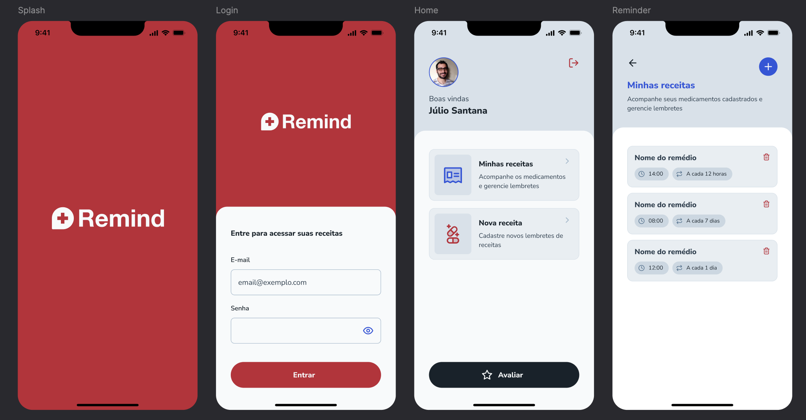

# Remind - Medication Reminder App 📱💊

Remind is a beautifully designed medication reminder app that helps users manage their medication schedules with ease and efficiency. The app provides a seamless experience to track prescriptions, schedule reminders, and ensure better health management.

# Features ✨

- Login & Registration: Secure authentication to access personal reminders.
- User-Friendly Interface: Intuitive UI/UX designed with clarity and simplicity.
- Personalized Schedules: Add and manage your medications with flexible reminder options.
- Cloud Integration: Stores user data securely in Firebase, including image uploads for better tracking.
- MVVM-C Architecture: Clean and scalable design architecture to ensure maintainability and ease of development.

# Technologies Used 🚀

- UIKit: For building responsive and elegant user interfaces.
- Firebase: To manage user authentication, store data, and handle image uploads.
- MVVM-C (Model-View-ViewModel-Coordinator): Architecture to maintain separation of concerns and promote scalability.
